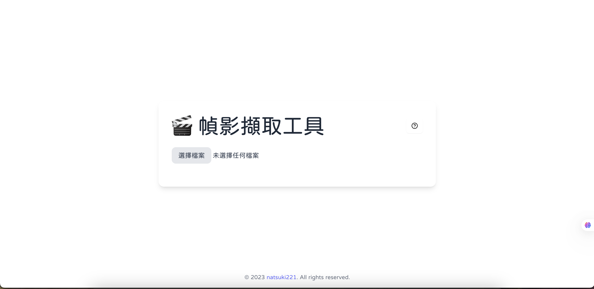

# 🎬 VideoSnapper 幀影擷取工具 

 


> 一鍵擷取影片畫面，讓創意隨時停格

---

## 🌟 功能亮點

- 🎞 **多格式支援**：`.mp4`、`.avi`、`.mov`、`.mkv`、`.flv` 等主流影片格式
- 🖱 **直覺式操作**：上傳後即可播放、拖曳進度、自由控制
- 📸 **一鍵截圖**：點擊按鈕或快捷鍵 `C` 立即擷取當前畫面
- 💾 **多種輸出格式**：支援 `PNG`、`JPEG`、`WebP` 格式下載
- ⌨️ **鍵盤快捷鍵**：`Space` 播放／暫停、`C` 截圖，加速工作流程
- ✅ **簡潔回饋**：截圖完成動畫提示，操作更明確

---

## 🚀 快速上手

```bash
# Project clone
git clone https://github.com/natsuki221/VideoSnapper.git
cd VideoSnapper/video-snapper

# 安裝依賴
npm install

# 啟動開發伺服器
npm run dev
```

打開瀏覽器，前往 [http://localhost:5173](http://localhost:5173) 開始擷取之旅！

---

## 🛠️ 技術棧


- ⚡️ [Vite](https://vitejs.dev/) + [React](https://reactjs.org/) + [TypeScript](https://www.typescriptlang.org/)
- 💅 [Tailwind CSS](https://tailwindcss.com/) + [shadcn/ui](https://ui.shadcn.com/)
- 🎞 [Framer Motion](https://www.framer.com/motion/) – 動畫效果
- 💾 [FileSaver.js](https://github.com/eligrey/FileSaver.js) – 圖片檔案下載
- 🎨 [Lucide Icons](https://lucide.dev/) – 矢量圖示


---

## 🖼️ 範例截圖



---

## 💡 進階客製化

- 🎯 **更多快捷鍵**：在 `App.tsx` 的 `handleKey` 中新增自定義按鍵
- 📦 **壓縮輸出**：整合 `browser-image-compression`，減少影像大小

---

## 🙌 貢獻指南

歡迎提交 PR、回報 Issues 或提出功能建議，一起打造更強大的 VideoSnapper！

---

## 📄 授權聲明

MIT License © 2025 [natsuki221](https://github.com/natsuki221)
